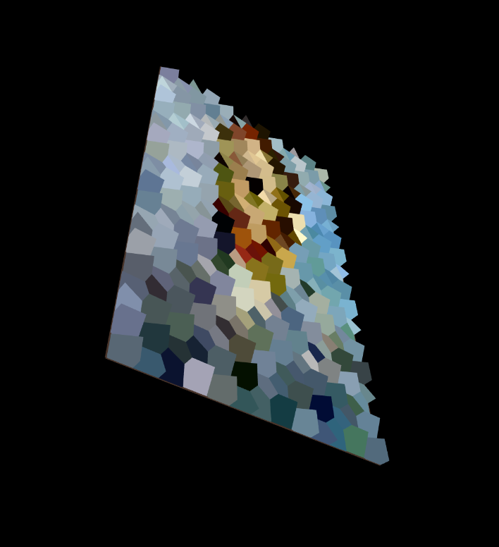

# TriangularPixelizer
The app takes an input image (can be any image) and a defined resolution, and converts it into a 3D representation of triangular voxels. 

Mobile isnt the best but it works

## Detailed Explanation

The image loads the image using p5js preload so that the colours and units are calculated after loading to prevent errors. 

Colours are calculated by iterating over the image in the amount of steps needed to match the defined resolution for the voxel image. 
The colours are then stored into an array and when the image is rendered the colour for each pixel is retrieved.

Units are then calulated based on the size of the window, where a 'pixel' size is calculated based on screen size and specified dimension size.

Every frame the 3D image is rendered by first rendering out the single back facing rectangle. 
Then the canvas is transformed to the starting position (top left corner) of the back rectangle.
Next the rotation is calculated pseudo randomly for the triangle, then the triangle is rendered.
The triangle is rendered using the calculated units and a triangle strips webGL function. 
After the shape is rendered the rotation is undone, the canvas is moved over a pixel, and the process repeats.
If the canvas reaches the end row of a line of pixels then it will move back over to the right and down a line before continuing.
It operates similarly to a type writer.

### Future ideas
##### If I ever come back to this
- [ ] Improved mobile layout (Design)
- [ ] Single rendering of triangular object instead of multiple (Performance)
- [ ] Select rendered image (new feature)
- [ ] Upload an image to render (new feature)